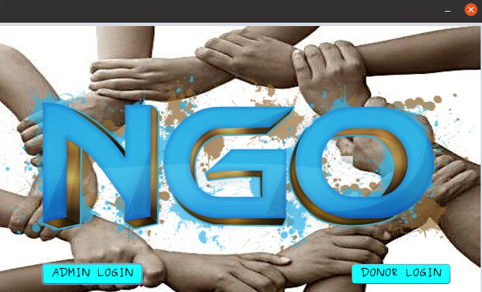
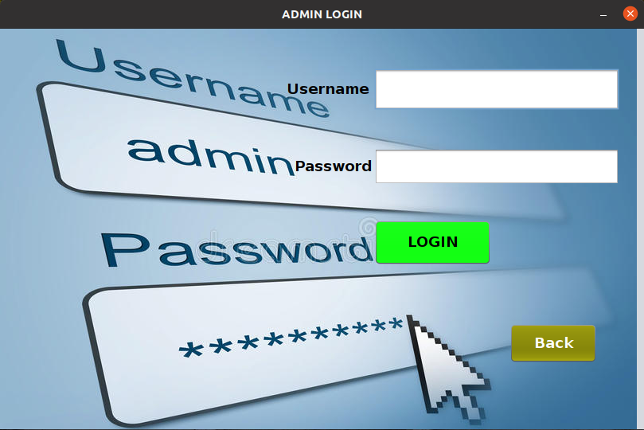
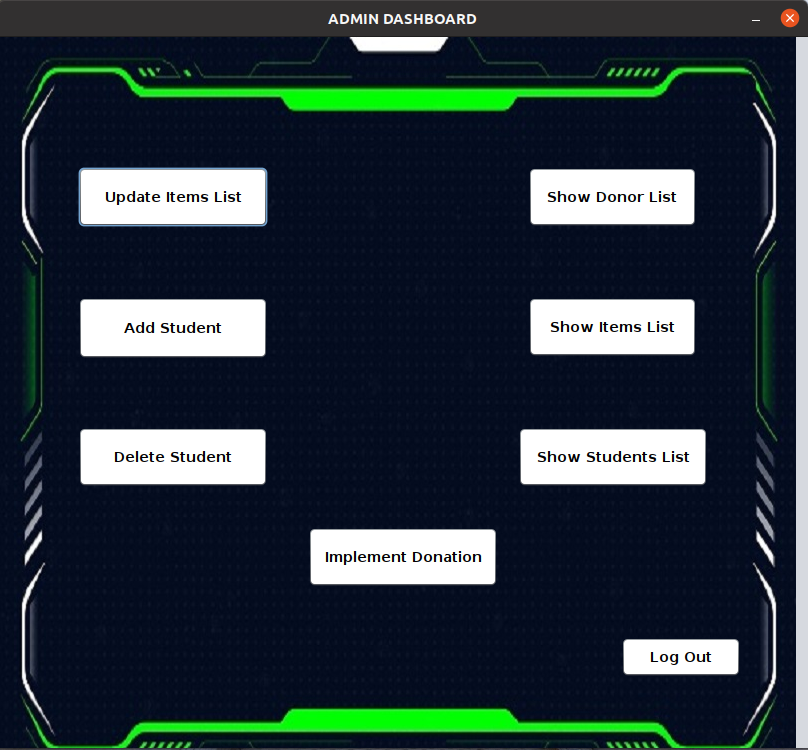
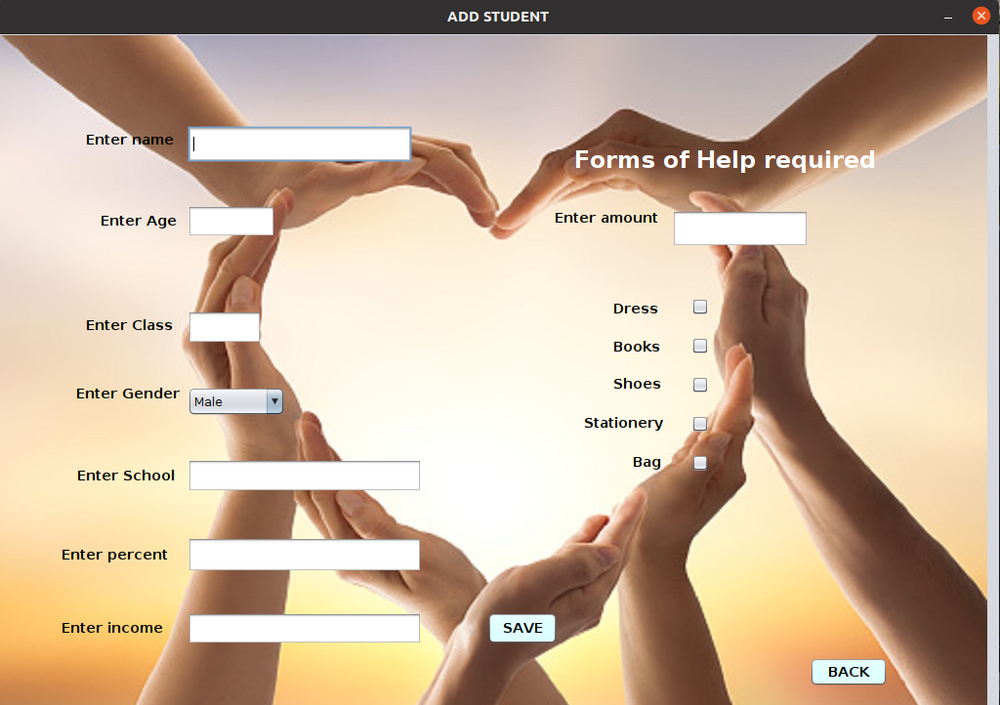
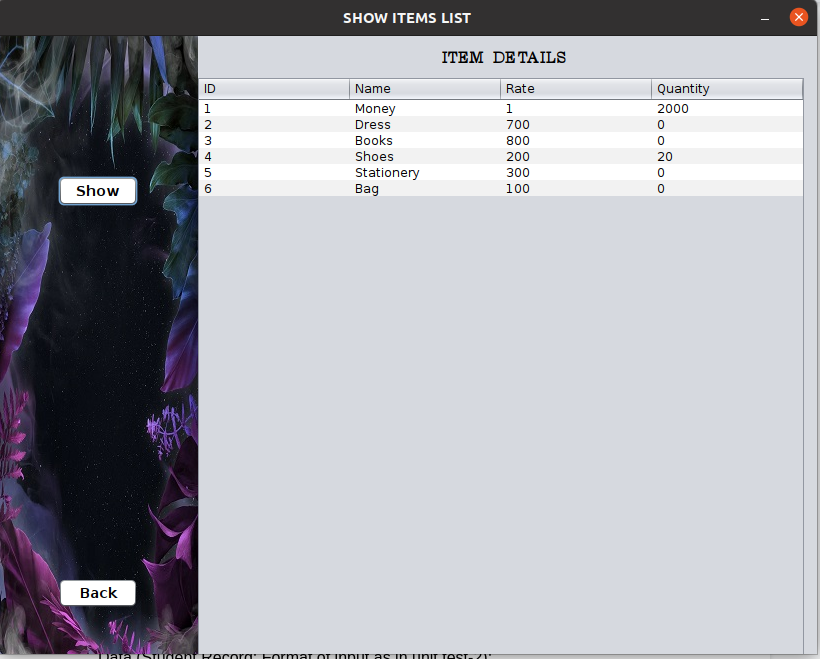
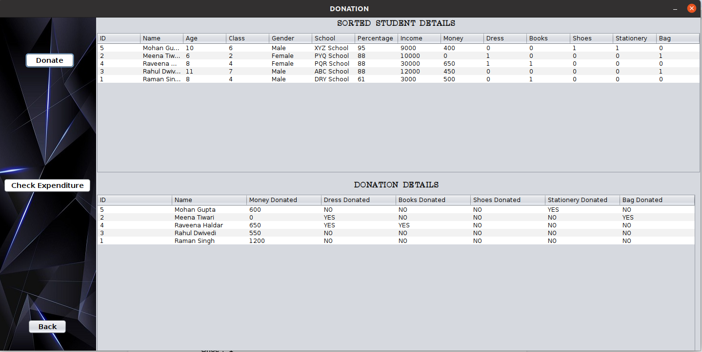
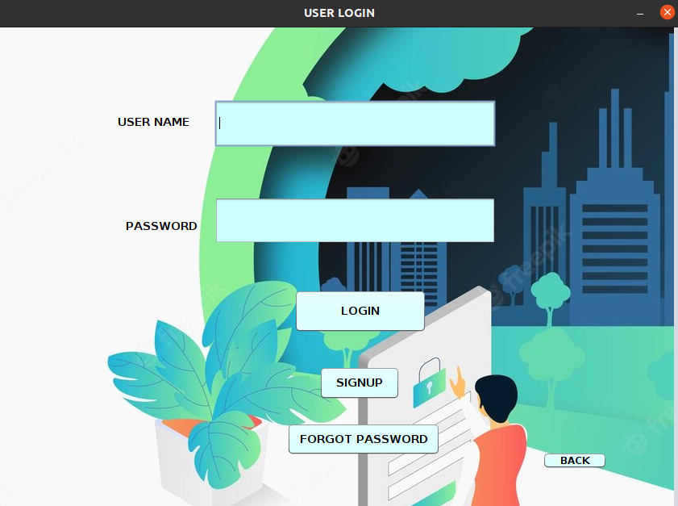
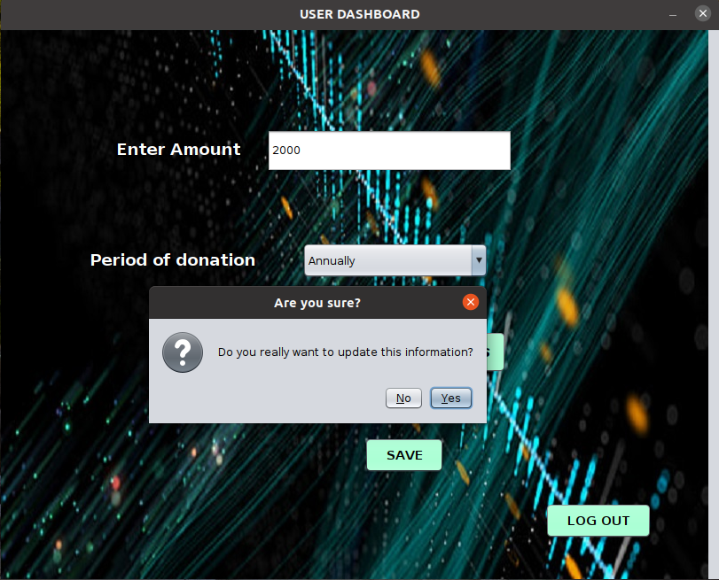
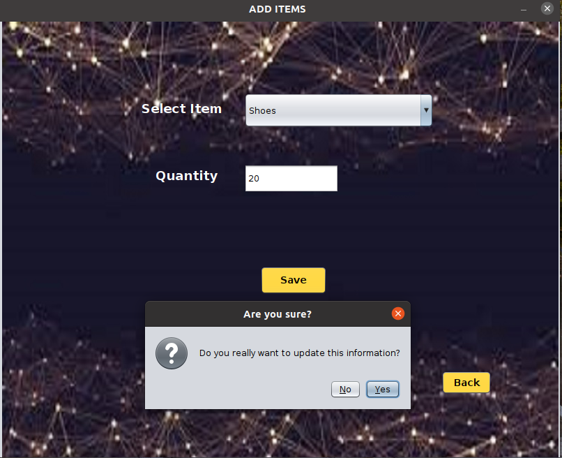

# NGO-Management-System
<!-- A GUI Software for running an NGO for poor students -->

This project was undertaken by [Anirban Haldar](https://github.com/lostsoul23), [Ayush Kumar Dwivedi](https://github.com/ayushdwivedi1254) and [Ketan Gupta](https://github.com/Gupta-19) under the guidance of Professor Abir Das for the course Software Engineering Laboratory (CS29202).


## Objective

The primary goal of the software is to maximise the productivity of the
NGO and minimise the time spent on tasks that can be easily managed
using a user-friendly software. It also helps the NGO to keep
track of all the monetary expenses and expenditure and to efficiently
implement the donations in an effective way.
## Project
The NGO Management System is fully implemented using the JAVA
programming language and makes use of MySQL for database
management. It comes with a simple to use, interactive and user-friendly
GUI for the various types of users of the system. It is flexible in
nature and can be easily extended beyond its current intended purpose
to almost any kind of NGO/ any other such related organisations or
bodies that need it. It provides an exhaustive list of features that makes the
donation implementation process very smooth for all concerned parties.
A well-built and executed software will help the NGO(s) attract more
donors and sponsors. Further, it will also enable better utilisation of the
resources at their disposal.


## Build Instructions

- First we need to open up mysql in the terminal and login as root.

- Then we run the following command to create a new user:
```bash
  CREATE USER 'akd'@'localhost' IDENTIFIED BY 'helloakd';GRANT ALL PRIVILEGES ON *.* TO 'akd'@'localhost';
```

- Next, we login as this user:
```bash
  $ mysql -u akd -p (enter password as 'helloakd')
```
- When prompted for the password, we enter: 'helloakd'.

- We run the setup.sql file to setup the database of the Project:
```bash
  source <path_to_sqlsetup.sql>
```
- Finally, we can build the project in Apache NetBeans and run it.


## Features
- Provides two levels of privileges: Admin and Donor/ User.
  
- The Admin corresponds to the main operator of this software who has administrative access and has the power to add or delete students, update items list,   access all details and implement donation.
  
- The Admin dashboard displays all the actions that the admin can perform.
  
- Adding student details is one of the prime jobs of the admin of the software. These details are further used to decide the order of donation.
  
- The admin has the power to view the current donor list, updated items list and current students list.
  
- The admin has the right to implement donation and see the final donations made to the current students in the database as per the available funds,   available items and donation criteria.
  
- The donor login is available with the signup and forgot password options also.
  
- The User Dashboard allows the user (donor) to donate monetary amounts either annually/ semi-annually.
  
- The Add Items allows the donor to make non-monetary donations of various kinds by selecting from a dropdown list and also specifying the quantity along with it.<br>
  <br>


## Scope
The NGO Management System can be deployed as a desktop application for all the users and organisations who want a user friendly experience while handling all the operations of an NGO. The database can be accessed using the local network. The actual logistics are yet to be taken care of, after which, the app can be released for commercial use.
